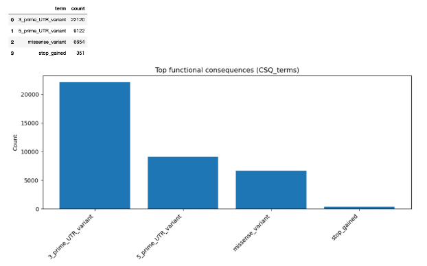
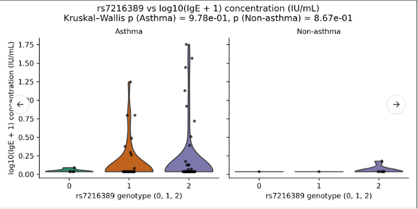
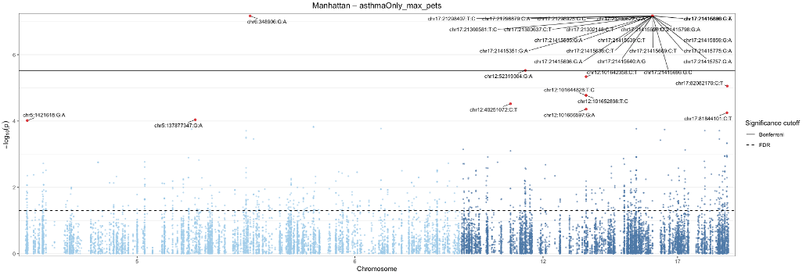

# 🧬 GWAS Variant Processing & Functional Annotation Pipeline

## Overview

This repository contains a reproducible, Python-based pipeline for
**genome-wide variant preprocessing, QC, functional annotation, and
association testing** of WGS VCF files.\
The workflow was developed for the **ImmPort URECA cohort**, focusing on
population-specific variant filtering (e.g., Black participants) and
downstream annotation using **Ensembl VEP**, **dbSNP b157**, and
**clinical association testing**.

The notebook (`GWAS_Trial-2.ipynb`) provides:\
- Chromosome-level VCF subsetting to phenotype IDs\
- Rigorous quality control (QUAL ≥ 70, DP ≥ 10, MAF ≥ 0.05)\
- Functional consequence annotation via the **Ensembl VEP REST API**\
- Integration of **dbSNP** functional and clinical (CLNSIG) metadata\
- Parallelized execution across chromosomes\
- Clinical association testing and visualization of GWAS results\
- **Extraction of all pathogenic variants followed by non-parametric
trend testing of clinical traits by genotype using the Kruskal--Wallis
test**

------------------------------------------------------------------------

## 🧭 Pipeline Summary

### **Stage 1 --- Subset & QC (per chromosome)**

Subset VCFs to phenotype-matched samples and apply strict quality
control including SNP-only filtering, minimum QUAL thresholds, and minor
allele frequency filtering.

------------------------------------------------------------------------

### **Stage 2 --- Functional Annotation (VEP API)**

Queries the **Ensembl VEP REST API** in batches of rsIDs and appends
gene-level functional annotations.

------------------------------------------------------------------------

### **Stage 3 --- Functional Filtering**

Retains biologically relevant variants (missense, UTR, start/stop
lost/gained).

------------------------------------------------------------------------

### **Stage 4 --- Multi-Chromosome Parallelization**

Processes chromosomes in parallel using **ProcessPoolExecutor**.

------------------------------------------------------------------------

### **Stage 5 --- dbSNP b157 Integration**

Adds functional flags and clinical significance (`CLNSIG`) using
RefSeq-based dbSNP b157 archive.

------------------------------------------------------------------------

### **Stage 6 --- Visualization of Functional Variants**

Produces bar charts and CSV summaries of functional consequence
distributions.

#### Example Functional Annotation Output

Below is an example barplot produced by the pipeline:

------------------------------------------------------------------------

### **Stage 7 --- Association Analysis on Clinically Annotated SNPs**

Performs association testing on CLNSIG-annotated SNPs using:

-   Logistic regression for binary traits\
-   Linear regression for numeric traits\
-   Fisher's Exact Test for sparse contingency tables

------------------------------------------------------------------------

### **Stage 8 --- Pathogenic Variant Extraction & Non-Parametric Trend Testing**

All variants annotated as **pathogenic** are extracted and evaluated
using a **Kruskal--Wallis test** to assess clinical trait trends across
genotype groups without normality assumptions.

#### Example Non-Parametric Test Output

Below is an example plot produced by the pipeline:

------------------------------------------------------------------------

### **Stage 9 --- GWAS Visualization and Clinical-Stratified Manhattan Plots**

Generates publication-ready Manhattan, QQ, volcano, and MAF plots with
clinical stratification.

#### Example Manhattan Plot

Below is an example Manhattan plot produced by the pipeline:

------------------------------------------------------------------------

## ⚙️ Dependencies

pip install pandas numpy requests statsmodels matplotlib scipy

------------------------------------------------------------------------

## 📁 Output Structure

per_chrom_outputs_new/ ├── chr5.annotated.csv ├──
assoc_clinical_asthma.csv ├── significant_hits_FDR_lt_0p05.csv ├──
pathogenic_kruskal_results.csv └── all_chrom_summary.csv

------------------------------------------------------------------------

## 🧠 Key Features

-   Parallelized GWAS pipeline\
-   Clinical and functional SNP annotation\
-   Fisher's Exact Test and Kruskal--Wallis integration\
-   Automated pathogenic variant analysis\
-   Publication-ready figures

------------------------------------------------------------------------

## 📘 Citation & Acknowledgments

Sarwal R. et al., UCSF BCHSI --- GWAS Functional Annotation Workflow
(2025)

------------------------------------------------------------------------

## 🪪 License

MIT License © 2025 Reuben Sarwal
